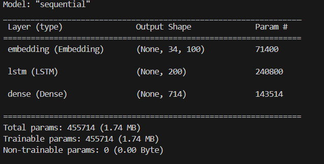
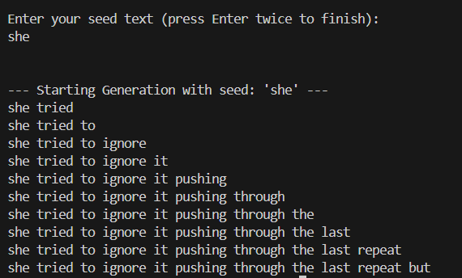

# Next Word Generator Using LSTM

## Description

This project is a command-line based text generation tool built using deep learning techniques, specifically a Long Short-Term Memory (LSTM) neural network. It is trained on a custom textual corpus provided by the user and is capable of learning the structure, vocabulary, and sequential patterns of the text. Once trained, the model can generate realistic and coherent continuations of input text based on learned language patterns.
The system leverages natural language processing (NLP) for sentence tokenization and uses Keras with TensorFlow backend to build and train the neural network. The model architecture includes an Embedding layer, a single LSTM layer, and a Dense output layer with softmax activation for multi-class word prediction.
If a trained model exists, the system intelligently loads it to avoid redundant training. Otherwise, it begins training from scratch based on the provided corpus.
Users interact with the model via the command line, entering a seed sentence or phrase. The model then generates a sequence of words, simulating how a human might complete the sentence or story. This makes the tool ideal for experimenting with generative text models, language modeling, and understanding LSTM-based sequence generation.

## Features:

- Trains on any .txt file containing a multi-line, multi-sentence corpus

- Saves the trained model to disk to avoid retraining

- Loads existing model on re-runs

- Takes user input from the command line and generates text word by word

- Clean structure using classes and functions

- All warnings and logs are suppressed for a cleaner interface

## Project Structure:

1. A text file (corpus_text.txt) containing your training data
2. A Python script (text_generator.py) which handles training, loading, and generation
3. An optional model file (text_gen_model.h5) created after training

## Requirements:

- Python 3.7 or above

- TensorFlow

- NumPy

- NLTK

## Usage:

Place your custom corpus in corpus_text.txt.

Run the script using Python.

If it's the first run, the model will train on your corpus; else, it loads the saved model.

Enter seed text at the prompt. The model will then generate and display a sequence of words.

## Model Architecture:

Embedding layer with 100 dimensions

LSTM layer with 200 units

Dense output layer with softmax activation

Categorical crossentropy loss

Trained for 150 epochs using the Adam optimizer

## Results

